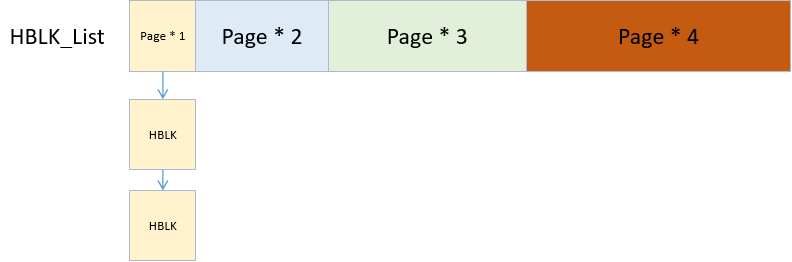
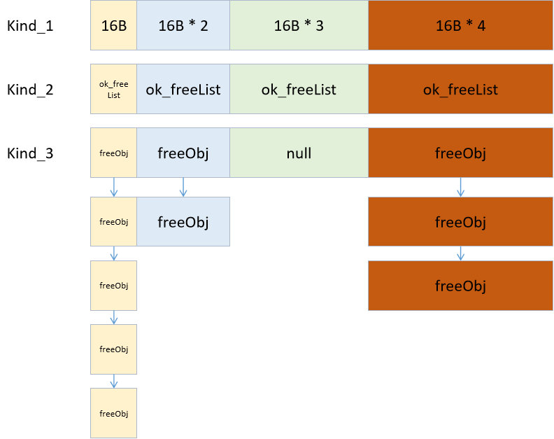

Mono 是一个开源的.Net 框架实现，Boehm-Demers-Weriser 垃圾收集器（简称 Boehm GC）是其支持的垃圾收集器之一。Boehm GC 是一个保守的标记-清除垃圾收集器，适用于 C 和 C++等不具备内置垃圾收集机制的预研。分析 Boehm GC 的源码可以帮助我们理解其工作原理和实现细节。

# 1. 源码结构

Boehm GC 的源码可以在 GitHub 上找到，主要位于`mono/external/bdwgc`目录下，以下是一些关键文件和目录：

- `gc.h`：Boehm GC 的头文件，定义了主要的数据结构和函数接口。
- `alloc.h`：内存分配相关的实现。
- `mark.c`：标记阶段的实现。
- `reclaim.c`：清除阶段的实现。
- `headers.c`：对象头信息管理的实现。
- `malloc.c`：`malloc`和`free`函数的实现。
- `finalize.c`：对象终结器(finalizer)相关的实现。
- `misc.c`：GC 的实现。

# 2. 阶段

Boehm GC 是一种标记清除的 GC 方式。其整体过程可粗略分为四个阶段：

1. 准备阶段：所有对象的 MarkBit 重置。
2. 标记阶段：从 Root 出发进行扫描，将可达对象进行标记。
3. 清理阶段：扫描托管堆，将所有未标记的对象返回给 freelist。
4. Finalization 阶段：所有注册了终结器的雾效对象加入终结器队列处理。

# 3. 内存分配

## GC_size_map[2049]

Boehm GC 对于对象的内存管理是区分内存类型和内存大小的。

- 内存类型分为 NORMAL（普通内存）、PRTFREE(指针内存) 和 UNCOLLECTABLE(非回收内存) 三类。
  - 应用程序调用普通内存最为频繁，非回收内存是 BOEHM 自己管理的内存，MAXOBJGRANULES 为 128，每个 GRANULES 是一个分配粒度，即 16 字节，这个是针对小对象来说的，128\*16=2048
- 根据对象占用内存大小不同，又分为大对象和小对象。

ok_freelist 这个数组每个元素为一个空闲链表的指针，指向的内存块的大小是 index16

## HBLK

`GC_hblkfreelist[N_HBLK_FLS+1]`数组 N_HBLK_FLS=28，GC_hblkfreelist 每个元素存储的也是一个空闲内存链表，与 ok_freelist 不同的是，

运行时从操作系统申请的堆内存被划分成一个一个的内存块进行管理，称为 HBLK。HBLK 的大小不同，其粒度为内存页大小的整数倍，并通过数组记录 HBLK 链表，数组小标（0 除外）代表当前位置链表中 HBLK 管理的相邻 Page 的数量。比如数组下标为 1 的位置，其链表内每个 HBLK 大小为 1 个 Page，下标为 4 的位置，HBLK 的大小则为 4 个 Page。



## 大对象存储

对于大对象分配，将大对象的内存大小向上计算，得到满足大小的 HBLK 粒度，然后从对应粒度的 HBLK 粒度，然后从对应粒度的 HBLK 链表中找到可用的 HBLK 进行存储。

## 小对象存储

对于小对象的分配，由于每个对象实际占用的内存大小各不相同，为了避免内存被划分的稀碎，BoehmGC 对于小对象的内存分配也是分粒度的，一般以 16B 作为基数。

一个 MAXOBJBYTES（2048+1）个元素的数组，每个数组为一个整数值，分配该内存为了在分配内存时快速定位出分配的粒度的倍数（其实完全可以用(bytes+16-1)/16 来规避掉这个数组，这么做应该是为了减少计算量...），而 16 这个是 BOEHM 分配内存的最小粒度，也就是说分配 1 字节，BOEHM 也会给你分配 16 字节的内存。

小对象并不是直接存储在 HBLK 中，而是将 HBLK 中的 Page 根据指定的小对象内存粒度进行拆分，这样就形成了一小块一小块不同粒度的内存块，将同样粒度的内存块串成链表，就有了不同粒度的可用内存链表(ok_freelist)。另外，上文说到，GC 回收的内存也会被返回给 FreeList。

当申请创建小对象时，根据对象所占内存向上计算的内存粒度，然后查找对应粒度的 FreeList，找到一块可用的内存，将对象存储进去，然后将该块内存从 FreeList 移除。

当对应粒度的 FreeList 为空时，会触发一次 GC，尝试回收内存块，如果还没有可用的内存块，则查找 HBLK 链表，找到一块可用的 HBLK，将 HBLK 中的 Page 拆分，补充 FreeList。

这里需要注意的点是，由于对象内存分类类型，所以不同类型的对象不能存放到一起，因此是每个类型的内存都维持了一个数组，里面记录着可分配给当前类型的不同粒度的内存块的链表。而向 HBLK 申请补充 FreeList 也一样，一旦 HBLK 对某一类型和粒度的对象进行了拆分，这一整个 HBLK 就不能再用与存储其他类型和粒度的对象了。

由此我们可以得出，在 Unity 中，创建均匀且大量使用的小对象对于内存是更友好的。而创建尺寸各异且数量很少的对象就会导致 HBLK 被拆分后实际有没有那么多对象可存，从而浪费内存。



Boehm GC 提供了`GC_malloc_kind_global`函数用于内存分配。该函数首先尝试从自由列表中分配内存，如果自由列表中没有合适的块，则触发垃圾收集。内存分配阶段位于`malloc.c`文件中。

```c
GC_API GC_ATTR_MALLOC void * GC_CALL GC_malloc_kind_global(size_t lb, int k)
{
    GC_ASSERT(k < MAXOBJKINDS);
    // 判断是否为小对象，(1<<12)/2 也就是2048字节为小对象。
    if (SMALL_OBJ(lb)) {
        void *op;
        void **opp;
        size_t lg;
        DCL_LOCK_STATE;
        // 有没有空闲内存，没有尝试释放GC，如果还是没有，使用大对象分配
        GC_DBG_COLLECT_AT_MALLOC(lb);
        LOCK();
        lg = GC_size_map[lb];
        opp = &GC_obj_kinds[k].ok_freelist[lg];
        op = *opp;
        if (EXPECT(op != NULL, TRUE)) {
            if (k == PTRFREE) {
                *opp = obj_link(op);
            } else {
                GC_ASSERT(0 == obj_link(op)
                          || ((word)obj_link(op)
                                <= (word)GC_greatest_plausible_heap_addr
                              && (word)obj_link(op)
                                >= (word)GC_least_plausible_heap_addr));
                *opp = obj_link(op);
                obj_link(op) = 0;
            }
            GC_bytes_allocd += GRANULES_TO_BYTES((word)lg);
            UNLOCK();
            return op;
        }
        UNLOCK();
    }

    /* We make the GC_clear_stack() call a tail one, hoping to get more */
    /* of the stack.
    // 大对象分配                                                 */
    return GC_clear_stack(GC_generic_malloc(lb, k));
}
```

从这段代码可以看出当调用内存分配的时候，BOEHM 首先会根据需要分配的内存大小来做选择，小于 2048 字节进行小对象分配，大于进行大对象分配。小对象会先根据缓存清空，如果有空闲就直接返回，并且将分配的东西移除 freelist，没有在进行分配。

```c
/* Allocate lb bytes for an object of kind k.           */
/* Should not be used to directly to allocate objects   */
/* that require special handling on allocation.         */
GC_INNER void * GC_generic_malloc_inner(size_t lb, int k)
{
    void *op;

    GC_ASSERT(I_HOLD_LOCK());
    GC_ASSERT(k < MAXOBJKINDS);
    if (SMALL_OBJ(lb)) {
        struct obj_kind * kind = GC_obj_kinds + k;
        size_t lg = GC_size_map[lb];
        void ** opp = &(kind -> ok_freelist[lg]);

        op = *opp;
        if (EXPECT(0 == op, FALSE)) {
          if (lg == 0) {
            if (!EXPECT(GC_is_initialized, TRUE)) {
              DCL_LOCK_STATE;
              UNLOCK(); /* just to unset GC_lock_holder */
              GC_init();
              LOCK();
              lg = GC_size_map[lb];
            }
            if (0 == lg) {
              GC_extend_size_map(lb);
              lg = GC_size_map[lb];
              GC_ASSERT(lg != 0);
            }
            /* Retry */
            opp = &(kind -> ok_freelist[lg]);
            op = *opp;
          }
          if (0 == op) {
            if (0 == kind -> ok_reclaim_list &&
                !GC_alloc_reclaim_list(kind))
              return NULL;
            op = GC_allocobj(lg, k);
            if (0 == op)
              return NULL;
          }
        }
        *opp = obj_link(op);
        obj_link(op) = 0;
        GC_bytes_allocd += GRANULES_TO_BYTES((word)lg);
    } else {
        op = (ptr_t)GC_alloc_large_and_clear(ADD_SLOP(lb), k, 0);
        if (op != NULL)
            GC_bytes_allocd += lb;
    }

    return op;
}
```

# 4. 标记阶段

标记过程为 STW 的，通过标记栈，一次从 UNCOLLECTABLE 对象和 ROOT 对象出发进行遍历，将所有可被遍历到的对象进行标记。当标记栈被清空时，标记阶段结束，此时未被标记的对象被认为是可回收的。

其中，ROOT 对象包括以下三类：

- 寄存器内的对象
- 栈上的对象
- 静态区的对象

```c
void GC_mark_from_roots(void)
{
  // 遍历根集，标记所有可达的对象
  for (each root in root_set) {
    GC_mark_object(root);
  }
}

void GC_mark_object(void *obj)
{
  // 如果对象已经被标记，则返回
  if (GC_is_marked(obj)) {
    return;
  }

  // 标记对象
  GC_set_mark(obj);

  // 递归标记对象的所有引用
  for (each reference in obj) {
    GC_mark_object(reference);
  }
}
```

# 5. 清除阶段

清理阶段实际上并不是一个真正的独立阶段。因为这个阶段并不是真的停下来什么都不做开始清理内存，其对于内存的处理分为几种情况。

- 对于未标记的大对象，由于其存储在 HBLK 中，直接将其所占用的内存返回给 HBLK FreeList。
- 对于存储小对象的 Page，如果其 MarkBit Table 中都是可被清除，则整页返还给 HBLK FreeList。
- 对于有小对象不可清除的 Page，暂时不做处理，等到出现上文分配内存需要查找可用 FreeList 时，再对要分配的类型和粒度的 Page 进行检查，将其中可以回收的内存返还给 ok_FreeList。

这样做的好处是当分配内存操作触发 GC 后，不需要立刻将所有内存都进行回收，只需要对一部分当前要分配的类型和粒度的内存进行回收即可。

```c
void GC_reclaim(void)
{
  // 遍历堆中的所有对象
  for (each obj in heap) {
    // 如果对象未被标记，则回收
    if (!GC_is_marked(obj)) {
      GC_add_to_free_list(obj);
    }
  }
}
```

# 6. 并发垃圾收集

Boehm GC 支持并发垃圾收集，可以在应用程序运行时进行垃圾收集，从而减少暂停时间。并发垃圾收集的主要步骤包括：

1. 初始标记：暂停应用程序，标记从根对象到可达的对象。
2. 并发标记：在应用程序继续运行的同时，标记从初始标记阶段标记的对象可达的所有对象。
3. 重新标记：暂停应用程序，标记在并发标记阶段新创建或修改的对象。
4. 并发清除：在应用程序继续运行的同时，回收未标记的对象。

```c
void GC_concurrent_collect(void)
{
  // 初始标记
  GC_initial_mark();
  // 并发标记
  GC_concurrent_mark();
  // 重新标记
  GC_final_mark();
  // 并发清除
  GC_concurrent_sweep();

  // 其他操作
  ...
}
```

# 7. 写屏障（Write Barrier）

为了支持并发垃圾收集， Boehm GC 使用写屏障机制。写屏障是一种在对象引用或修改时执行的代码，用于跟踪对象引用的变化。写屏障的实现主要在`gc.c`文件中。

```c
void GC_write_barrier(void *obj, void *value)
{
  // 更新卡表
  GC_cardtable_update(obj, value);

  // 其他操作
  ...
}
```

# 8. 终结器(Finalizer)

终结器时对象在被垃圾收集器回收之前执行的一段代码，用于释放非托管资源或执行其他清理操作。Boehm GC 支持终结器的注册和执行，相关实现主要在`finalize.c`文件中。

我们知道，运行时管理的是托管对象，假设现在有一个托管对象 A，且 A 引用了非托管对象 B。为了避免内存泄漏，就需要在 A 被释放之前先手动释放对 B 的引用。我们固然可以在特定的逻辑节点进行这个操作，但更多的时候，我们希望在 A 被回收前自动结束对 B 的引用。

从上文可以知道，A 的回收时在清理阶段或者新分配内存时由 GC 线程自己触发的，我们并不清楚这个操作发生的具体时间点。为了能够使这个操作可控，于是有了终结器机制。

所有注册了终结器的对象（比如重写了 Finalize 方法）会被额外存到一个单独的哈希表中，我们可以称之为 FinalizableList。意味着列表中的所有对象在被回收前都需要先执行终结器进行一些额外的操作。

那是不是说对于这些对象，只要简单地先执行终结器在释放就可以了呢？当然也不是。因为终结器中到底写了些什么逻辑运行时使不知道的，所以理论上就存在这样的情况：一个本来不可达的对象（未被标记的垃圾内存）在终结器中手动添加了某个可达对象到自己引用，于是终结器执行结束之后自己就变成非垃圾对象，也就是“复活”了。同样，该对象引用链之前的所有对象也跟着复活了。

基于此，在标记阶段结束时，会检查 FinalizableList 列表，将其中所有不可达的对象重新推到标记栈上，然后由其触发进行遍历，重新进行一轮标记。也就是先默认这些对象复活了。

这里需要注意的使，该阶段的本意是先保证这些 Finaliable 对象下游的对象不会被提前回收造成程序错误，然后对其执行终结器。然而一个 Finalizable 对象 A 可能在重新标记时遍历到另一个 Finalizable 对象 B，这是如果 A 合 B 都执行终结器被认为是不安全的，于是在遍历触发时，对象本身并不会被标记，只有在遍历过程中被其他对象引用时才会进行标记。

在这一轮标记结束后，将仍然未被标记过的 Finializable 对象从 FinalizableList 移除，加入一个等待执行终结器的队列 F-Queue。本轮 GC 便不再对这些对象进行回收。

F-Queue 中的对象会在适当的时机执行终结器并从队列中移除。这样在之后的 GC 过程中，如果该对象仍未被标记到，由于它即不再 FinalizableList 中也不在 F-Queue 中，就可以正常释放了，而且终结器也不会被重复执行。

由上可知，即使没有手动复活的擦欧总，注册了终结器的对象最少也要经过两轮 GC 才能真正被释放，而哪些被 Finalizable 对象直接或间接引用到的 Finalizable 对象甚至需要更多论的 GC 才会被释放，所以才会非必要不要随便注册终结器的说法。

终结器注册

当对象需要终结器时，可以通过`GC_register_finalizer`函数注册终结器。该函数将对象和终结器函数添加到一个终结器列表中。

```c
void GC_register_finalizer(void *obj, GC_finalization_proc finalizer, void *client_data)
{
  // 创建终结器条目
  finalizer_entry *entry = GC_new_finalizer_entry(obj, finalizer,client_data);

  // 将终结器条目添加到终结器列表中
  GC_add_to_finalizer_list(entry);
}
```

终结器执行

在垃圾收集的清除阶段，Boehm GC 会检查每个未标记的对象是否注册了终结器。如果注册了终结器，则将其添加到一个带执行的终结器队列中，而不是立即回收该对象。待垃圾收集完成后，Boehm GC 会执行这些终结器。

```c
void GC_finalize(void)
{
  // 遍历待执行的终结器列表
  for (each entry in finalizer_queue) {
    //  执行终结器
    entry->finalizer(entry->obj, entry->client_data);
  }
}
```

# 9. 根集管理

根集(Root Set)是垃圾收集器的起点，包括全局变量、栈变量和寄存器中的引用。Boehm GC 需要扫描根集以标记所有可达的对象。根集管理的实现主要在`root.c`文件中。

根集注册

Boehm GC 提供了`GC_add_roots`函数用于注册根集。该函数将根集的起始地址和结束地址添加到一个根集列表中。

```c
void GC_add_roots(void *start, void *end)
{
  // 创建根集条目
  root_entry *entry = GC_new_root_entry(start, end);

  // 将根集条目添加到根集列表中
  GC_add_to_root_list(entry);
}
```

根集扫描

在标记阶段， Boehm GC 会遍历根集列表，扫描每个根集中的引用并标记相应的对象。

```c
void GC_mark_from_roots(void)
{
  // 遍历根集列表
  for (each entry in root_list) {
    // 扫描根集中的引用
    GC_scan_root(entry->start, entry->end);
  }
}

void GC_scan_root(void *start, void *end)
{
  // 遍历根集中的每个引用
  for (each reference in start to end) {
    // 标记引用的对象
    GC_mark_object(reference);
  }
}
```

# 10. 并发垃圾收集的细节

并发垃圾收集是 Boehm GC 的一个重要特性，额可以在应用程序运行时进行垃圾收集，从而减少暂停时间。并发垃圾收集的实现涉及多个线程的协调和同步。

初始标记

初始标记阶段需要暂停应用程序，以确保根集和堆的一致性。初始标记阶段的主要任务是标记从根对象可达的对象。

```c
void GC_initial_mark(void)
{
  // 暂停应用程序
  GC_stop_world();

  // 标记从根对象可达的对象
  GC_mark_from_roots();

  // 恢复应用程序
  GC_start_world();
}
```

并发标记

并发标记阶段在应用程序继续运行的同时进行。Boehm GC 使用一个并发标记线程来标记从初始标记阶段标记的对象可达的所有对象。

```c
void GC_concurrent_mark(void)
{
  // 创建并发标记线程
  GC_create_mark_thread();

}

// 并发标记线程的主循环
void GC_mark_thread(void *arg)
{
  while (GC_is_marking()) {
    // 标记对象
    GC_mark_some_objects();
  }
  return NULL;
}
```

重新标记

重新标记阶段需要再次暂停应用阶段，以确保在并发标记阶段新创建或修改的对象也被标记。

```c
void GC_final_mark(void)
{
  // 暂停应用程序
  GC_stop_world();

  // 标记新创建或修改的对象
  GC_mark_from_roots();

  // 恢复应用程序
  GC_start_world();
}
```

并发清除

并发清除阶段在应用程序继续运行的同时进行。Boehm GC 使用一个并发清除线程来回收标记的对象。

```c
void GC_concurrent_sweep(void)
{
  // 创建并发清除的线程
  GC_create_sweep_thread();

}

// 并发清除线程的主循环
void *GC_sweep_thread(void *arg)
{
  while (GC_is_sweeping()) {
    // 回收未标记的对象
    GC_sweep_some_objects();
  }
  return NULL;
}
```

# 11. 写屏障的实现

写屏障是一种在对象引用或被修改时执行的代码，用于根据对象引用的变化。写屏障的实现主要在`gc.c`文件中。

写屏障的基本原理

写屏障的基本原理是，在每次修改对象引用时，记录下被修改的对象和新引用的对象。这样可以在并发垃圾收集时，确保新创建或修改的对象不会被错误地回收。

```c
void GC_write_barrier(void *obj, void *value)
{
  // 更新卡表
  GC_cardtable_update(obj, value);

  // 其他操作
  ...
}
```

卡表更新

卡表是一种用于根据对象引用变化地数据结构。每个卡片（card）对应堆内存中地一个固定大小地区域，每个卡片对应一个卡表条目。卡表条目是一个布尔值或标记为，表示该卡片是否包含对对象地引用。

```c
void GC_cardtable_update(void *obj, void *value)
{
  // 计算对象所在地卡片
  card_index = GC_card_index(obj);

  // 将卡片标记为“脏”
  GC_cardtable[card_index] = DIRTY;
}
```
