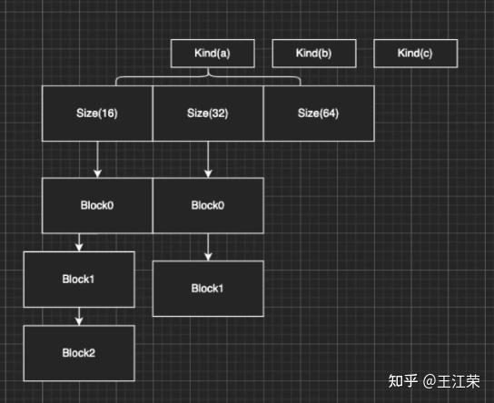
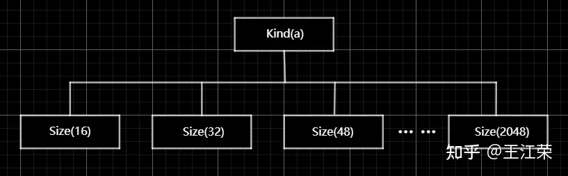
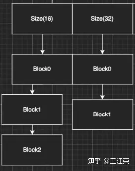
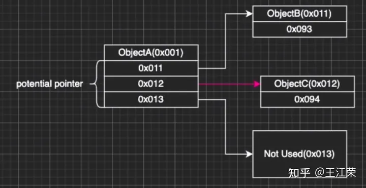

SGen 和 Boehm-Demers-Weiser 垃圾收集器（Boehm GC）是两种不同的垃圾收集器，它们在设计目标、实现方式和性能特性上有显著的区别。以下是它们的主要区别：

# 1. 设计目标

- SGen：
  - 设计目标：SGen 是 Mono 项目中的一个垃圾收集器，专为高性能和低延迟的场景而设计。它是一个分代垃圾收集器，旨在优化短生命周期对象的回收。
  - 使用场景：适用于需要高性能和低延迟的应用，如游戏和实时系统。
- Boehm GC：
  - 设计目标：Boehm GC 是一个保守的垃圾收集器，设计目标提供一个简单、稳定且易于集成的垃圾收集器。它不区分对象的生命周期。
  - 使用场景：适用于需要稳定和可靠的垃圾收集的应用，如服务器和桌面应用。

# 2. 垃圾收集算法

- SGen：
  - 分代收集：SGen 使用分代垃圾收集算法，将对象分为年轻代和老年代。年轻代对象通常声明周期较短，老年代对象生命周期较长。
  - 并发收集：SGen 支持并发垃圾收集，可以在应用程序运行时进行垃圾收集，从而减少暂停时间。
- Boehm GC：
  - 保守收集：Boehm GC 是一个保守的标记-清除垃圾收集器。它不区分对象的声明周期，所有对象都在同一个堆中。
  - 暂停时间：由于 Boehm GC 是一个标记-清除垃圾收集器，它在进行垃圾收集时可能导致较长的暂停时间。

# 3. 性能特性

- SGen：
  - 低延迟：由于使用了分代和并发收集，SGen 通常具有较低的延迟，适合实时应用。
  - 高吞吐量：分代垃圾收集算法可以提高垃圾收集的效率，从而提高应用程序的整体性能。
- Boehm GC：
  - 稳定性：Boehm GC 以其稳定性和可靠性著称，适合需要长时间运行的应用。
  - 较长暂停时间：由于使用标记-清除算法，Boehm GC 在进行垃圾收集时可能会导致较长的暂停时间，不适合对延迟敏感的应用。

# Boehm

Unity 2022 Mono 有两种 GC，一种是 sgen，另外一种 bdwgc，目前 unity 使用的 bdwgc，中文名叫贝姆垃圾回收。
bdwgc 有个巨大的缺点是 Stop-The-World 机制，这种机制在执行时会暂停运行中的程序，当完成垃圾回收后才恢复运行状态。
Unity 为了解决这个问题，采用增量式垃圾回收，可以在 ProjectSettings->Player->Use incremental GC(Experimental)
增量垃圾回收采用分帧逻辑。
Boehm 是一种保守式回收，SGen 是分代式回收，Java 引用计数内存回收（Reference Counting GC）结合了保守式的引用式内存回收。
分代式虽然优点很多，但是它们都要付出额外的代价。例如分代式的 GC，它要进行内存块的移动，一块内存在频繁分配区长时间不动的话，会被移动到长时分配去，造成额外消耗。另外每次回收的时候还要进行一个评估，判断当前内存是否是一个活跃内存，这些东西都不是免费的，而是要消耗额外的 CPU 性能。当然 sGen 也有它的优势，例如它是可移动的，可以进行合并的（可以减少内存碎片）等等。但是在计算力本身就很紧张的移动平台上，在花费 CPU 去计算内存的搬迁和移动实际上是不合算的，引用计数也有类似的问题，所以 unity 还是使用相对比较保守的 Boehm 回收。
Boehm 回收有两个特点，一是不分代和不合并，所以可能会导致内存碎片。二是所有保守式内存回收都是非精准式内存回收。
何为非精准？常规理解式我分配的内存你可能收不回来。实际上还有另一层意思：你没分配的内存你可能也用不了。也就是说，一是我已经分配出去的内存在没有人在引用它的情况下，不一定能收回来。二是我没有分配使用的内存，当你想去分配使用的时候也不一定用得了。

我们来从 Boehm 内存管理的简单模型入手（如下图），来理解为什么会导致前面的问题。

如图，Boehm 在内存管理实际上是两级的管理。第一级我们叫做类型（Kind），实际上就是一个三个元素的数组 GC_obj_kinds[3]，如下图：

它们来区分不同的类型，例如无指针类型(ptrfree)、一般类型(normal)和不可回收类型(uncollectable)。不可回收类型一般是回收器自己要用的一块内存，都会分配到 uncollectable。

每个 Kind 下面又包含一个列表：ok_freelist[MAXOBJGRANULES+1]，其中 MAXOBJGRANULES 值位 128，它也就是第二级的管理，如下图：

该数组中每一个元素表示它关联内存的大小，下标为 index 的元素对应大小为 16*index，因此下标为 0 的那个元素是没有用的。从下标为 1 元素开始对应着 16 字节，然后 32 字节，48 字节...，以 16 字节为增量，最多到 2KB（下标 `128*16=2048`）。

在每个 ok_freelist 元素下又挂着一层链表，如图：

链表里面的每个元素代表的就是一小块内存，其内存大小就是 ok_freelist[i]对应的大小。例如图中 Size(16)下面挂着 Block0，Block1，Block2，说明每个 Block 的大小都是 16 字节，Size(32)下面每个 Block 自然都是 32 字节。

所以总体来说，我们有一个 GC_obj_kinds[3]数组，然后每个 GC_obj_kinds 元素下面会有一个 of_freelist[MAXOBJGRANULES+1]数组。而 ok_freelist[index]里存的是一个链表指针，指向大小为`index*16`的内存块。

假设现在我们分配一个小于等于 16 字节大小的内存，那么就会把 Size(16)链表里的空闲内存块拿出来给用户。比如我就分配 8 字节的内存，但是会拿到一个 16 字节的内存块，那么多出来的 8 字节内存会被额浪费掉。但是如果在 Size(16)的链表里找不到可用的内存块，那么就会找 Size(32)的链表。如果在 32 字节里找到一个可用的内存块，由于我们要的内存只有 8 字节，明显小于 16，那么 Unity 会把这 32 字节的内存块一刀切成两刀，给用户 16 字节，剩下的 16 字节挂到 Size(16)的链表底下。若此时所有的 Size(n)里面都找不到可用的内存块，那么就会掉分配函数，分配一块较大的内存，然后将大内存分割为小内存链表存储在 ok_freelist 中，可以理解为一个内存池。

加入我们先分配一个 16 字节的内存，使用掉 Size(16)的 Block0，然后在分配一个 32 字节的内存，使用掉 Size(32)的 Block0，此时这两块内存在物理上是连接的，虽然在逻辑上他们之前属于不同的链表。若此时这两块内存都不使用了，要回收它们，会怎么做？一次分别插在对应的链表下吗？并不是这样。当我们这两块内存同时被使用的时候，Unity 在释放第一个 Block0 的时候会找后面的物理内存（也就是第二个 Block0）是否要被释放，发现这两块都要释放的时候，那么就会把它们回禀起来，让这个指针挂到更大的地方，也就是 Size(48)的链表下，从而去尽量减少整理内存碎片的问题。

也就是说 Unity 尽量会把空闲出来的内存回禀成一个较大的内存块，同时以移动指针的方式（注意不是移动内存）把它挂到一个合适的链表下面，这就是整个内存分配的一个策略。

我们再来谈谈回收，以及为什么说他是非精准的原因。如下图，假设我们要回收 ObjectA。

在保守内存回收器来看，当我要去回收一个内存开的时候，我会尝试找到这个内存块下面所有的指针（图中 0x011-0x013）指向的地址，并且标记为引用。例如图中 ObjectA 引用 ObjectB，当 ObjectA 发现不能被回收的时候，同时会标记 ObjectB 也不能回收，这样的算法我们称之为标记清除算法（ Mark&Sweep），即标记阶段通过标记所有根节点可达的对象，未被标记的对象则表示无引用、可回收，**所有从堆对象中分配的内存 Boehm 中均有记录**。

看着没什么问题，但是因为在内存层次上已经没有了整个 class 信息，那怎么知道这个东西是一个数还是一个指针的呢？因为我们知道 c++一份内存里的东西它可以表示任何东西，它可以是一个数也可以是一个指针，它是什么都可以。

那么我怎么知道它们是不是指针呢？**Boehm 用猜的**，所以我们管它们叫做潜在指针(potential pointer)，并不确定是不是一个真的指针。Boehm 会以一个 pattern 的方式来检查当前这个数有没有可能是一个指针。比如说我先去检查 0x011 地址里面有没有东西，发现 ObjectB，那么 ObjectB 就不会被回收，然后检查 0x012，发现 ObjectC，那么 ObjectC 同样不会被回收。但是实际上我们的 0x012 不是一个指针，也就是说逻辑上来讲 ObjectA 和 ObjectC 没有引用关系，但是恰好分配在 0x012 内存上。但是对于 Boehm 来说发现 0x012 指的这块地方有东西，因此 ObjectC 就回收不了。最后检查 0x013，发现它指向一块没有被使用的内存，那么 Boehm 就会把这块内存加到黑名单里，然后当你下次要进行大内存分配的时候，碰巧踩到了这个地址，Boehm 会告诉你这块内存你不能用，得再去分配一块。这样就很理解前面所说的非精准了，你要回收的内存可能收不回来，对于你没用的内存他也可能也不让你用。
